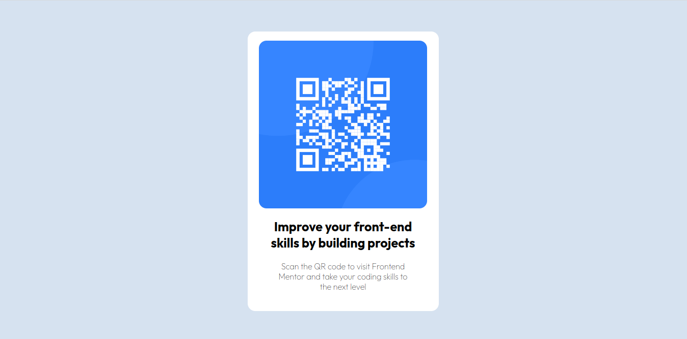
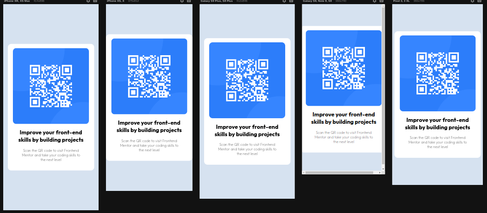

# Frontend Mentor - solução de componente de código QR

Esta é uma solução para o [desafio do componente de código QR no Frontend Mentor](https://www.frontendmentor.io/challenges/qr-code-component-iux_sIO_H).

## Índice

- [Visão geral](#visão-geral)
- [Captura de tela](#captura-de-tela)
- [Construído com](#construído-com)
- [O que aprendi](#o-que-aprendi)
- [Desenvolvimento contínuo](#desenvolvimento-contínuo)
- [Recursos úteis](#useful-resources)
- [Fernando Mendes](#autor)
- [Agradecimentos](#acknowledgments)


## Visão geral

### Captura de tela

#### Tela Desktop

[]

#### Tela Responsiva

[]


### Construído com

- HTML5
- CSS3
- Flexbox

### O que eu aprendi

Nesse projeto aprendi uma solução fácil para centralizar elementos aproveitando a responsividade
usando como base um elemento pai: 

``` 
HTML

<main class="main-container">
        <div class="qr-container">
            
            <h1 class="title">Improve your front-end skills by building projects</h1>
            <p class="paragraph">Scan the QR code to visit Frontend Mentor and take your coding skills to the next level</p>
        </div>
</main>

 CSS

.main-container {
    width: 100vw;
    height: 100vh;
    display: flex;
    flex-direction: column;
    justify-content: center;
    align-items: center;
}
```

### Desenvolvimento contínuo

Pretendo continuar focado em construir códigos limpos e desenvolver em projetos futuros tanto os conceitos de flex como os conceitos de grid.

### Recursos úteis

- [W3School](https://www.w3schools.com/css/default.asp) - Esse site sempre me ajuda a resolver qualquer problema relacionados a códigos de uma maneira fácil e muito rápida.
- [Dev em Dobro](https://www.youtube.com/@DevemDobro) - Este é um canal onde encontro muito material. Tem muito conteúdo relacionado ao desenvolvimento. Recomendo a todos que querem aprender sobre esse e outros conceitos relacionados.

## Autor

[Fernando Mendes](https://www.linkedin.com/in/fernandomendesti/)

## Agradecimentos

Gostaria de agradecer a toda comunidade do DEVQUEST: monitores, alunos e toda a equipe técnica que sempre está de prontidão para ajudar no que for preciso. Deixo aqui um abraço a todos que fazem parte desse projeto.